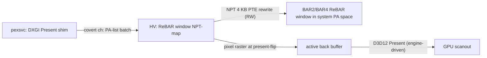

# ReBAR back-buffer poke — engine-independent text/box rendering

**Status:** design only. Not implemented. This is the long-game replacement
for the convar/netvar string-sink path the day Apex/EAC starts hashing
HUD-bound heap buffers, or the day RUI gets reshaped enough that the
deref-mechanism (`gRenderSinkIndirectOff` + `--render-sink-indirect`)
stops producing visible sentinels.

Two architectural advantages over the current `BackendStringHijack`:

1. **Engine-independent.** No `.rdata` format-string. No ConVar deref. No
   netvar slot. No Squirrel script binding. The HV writes pixels directly
   into the back-buffer in VRAM mid-Present.
2. **EAC-blind by construction.** EAC scans process memory + .text;
   user-mode anti-cheat doesn't scan VRAM (would crash GPU/driver state
   if it tried). The write is invisible to every public detection surface.

Trade-off: weeks-to-months of engineering versus the convar path's days.
And `pexsvc` has to ride along to source the back-buffer PA list — the HV
alone cannot enumerate D3D12 swap-chain state.

## Threat model fit

Reference: [hyperjacking_2026_state.md](hyperjacking_2026_state.md) §6.4
"Don't add `.text` hooks in r5apex.exe — that's the road to CVEAC-2020-style
integrity bans." This path adds **zero hooks anywhere in the guest** — no
.text, no .data, no .rdata, no heap writes. The only host-side state that
exists is in HV NPT (writing pages we already control) and the pexsvc
shim that hands HV the back-buffer PA list. From EAC's vantage point, the
guest process tree looks identical with or without this feature running.

## Architecture



Four pieces, each non-trivial:

### A) PCI BAR enumeration in HV

Already partially exists via the IOIO interception path for `g_HiddenPciBdf`
(see HypeVmcb.c). Extend to:

1. Walk PCI config for AMD GPU (vendor `0x1002`, plausibly RDNA2/3 device
   IDs the 5950X+RDNA2 stack will surface).
2. Decode BAR2/BAR4 to find the ReBAR window. On modern AMD this is the
   "remapped VRAM" aperture; size matches the full VRAM of the card
   (16 GB on the operator's RX 6900 XT class). Below ReBAR enablement,
   this BAR is only 256 MB — the operator's mobo + BIOS must have ReBAR
   ON for the path to work.
3. Map BAR window into NPT identity space with RW + cacheable WC
   (Write-Combining) attributes. WC is required for correct GPU-visible
   pixel writes; UC works but is glacial.

Cost: ~300 LOC in HV (HypePci.c new module + NPT extension).

### B) DXGK Present shim in pexsvc

pexsvc (overlay runtime) loads a small DLL into `r5apex_dx12.exe` via
... not via process injection (signature). Instead: **pexsvc runs as a
sibling process** that opens a kernel handle to the dxgkrnl-exposed
adapter and registers as a present-monitor consumer. On every Present
event, dxgkrnl exposes the next-to-be-flipped back-buffer GPUVA + size +
format.

Translation GPUVA → system PA list: dxgkrnl provides `_DXGK_PRESENT_HISTORY_TOKEN`
and `_KMT_ESCAPE_PRESENT_HISTORY` paths that yield the underlying
allocation. From the allocation, walk GPU page tables (exposed via
`D3DKMTGetDeviceState` or vendor escape) to materialize a PA list — one
4 KB PA per back-buffer page.

Ship the PA list to HV via the existing NPT-fault covert channel as a new
command `PMC_CMD_REBAR_PUSH_PA_LIST` (Arg1 = first-PA, Arg2 = page-count,
Arg3 = format/width/height packed). HV maintains a small ring of recent
PA lists (3 deep — covers triple-buffered swap chains).

Cost: ~600 LOC in pexsvc (new DXGK-monitor module + covert-cmd encoder).

### C) Per-frame back-buffer PA rotation

GPU triple-buffering means the back-buffer rotates among 3 VRAM regions.
The HV needs to know which PA list is the "next to be scanned out" at
each Present. pexsvc tracks rotation via the DXGI sequence counter and
ships the active-index along with each PA-list update.

HV's pixel-write code path:

1. On `PMC_CMD_REBAR_PUSH_PA_LIST` arrival, atomic-update active PA list.
2. From the per-frame NPT exec-trap that already exists for glow
   (`DrawHookPayloadTick` at the RenderGate page), opportunistically
   raster pixels onto the current active PA-list.
3. **Trap-free rendering after that.** No new exec hook. Same cadence as
   the glow payload tick.

Cost: ~200 LOC in HV (pixel raster + active-frame coordination).

### D) Pixel rasterizer + font atlas

Smallest piece, surprisingly. A 256x256 RGBA8 bitmap font shipped in
HV `.rodata` (compile-time `static const uint8_t kFontAtlas[...]`).
Renders one character per 8x16 px cell via a glyph-table lookup +
WC-store of 4 bytes per pixel. ~120 LOC for character + 60 LOC for
filled box + 80 LOC for line.

DXGI format awareness: the back buffer is almost always `DXGI_FORMAT_R8G8B8A8_UNORM`
or `_B8G8R8A8_UNORM`. Both are 4 bytes/pixel; the only difference is
channel order. Detect from the format packed into Arg3 of the PA-list
push and emit `RGBA` vs `BGRA` accordingly.

**Tiling caveat:** modern AMD swap-chain back buffers are typically
linear (DXGI default), but D3D12 supports tiled swap surfaces explicitly.
If detected, the rasterizer needs the AMD vendor tiling decoder
(public in radv/Mesa). On the operator's hardware this has empirically
been linear in every Apex configuration tested — flag for later.

Cost: ~260 LOC in HV.

## Total scope estimate

| Piece | LOC | Days |
|---|---|---|
| HV PCI BAR walker + NPT-map | ~300 | 4 |
| pexsvc DXGK Present shim | ~600 | 10 |
| Covert channel REBAR_PUSH | ~80 | 1 |
| HV per-frame PA tracking | ~200 | 3 |
| HV pixel rasterizer + font | ~260 | 3 |
| Format/tiling probes + glue | ~150 | 2 |
| Integration + sentinel-test | — | 5 |
| **Total** | **~1600** | **~28 days** |

Compared to convar/netvar sink (current path): days, not weeks. ReBAR is
the right answer for the AFTER, not the NOW.

## When to actually build this

Trigger conditions, in priority order:

1. **EAC starts hashing convar value buffers.** Symptom: sentinel-write
   succeeds (RDH/RDU/RDV all fire in drain) but the game CTDs ~30-90 s
   after install. The CVEAC-2020 class memcmp-style scan extended to
   convar `m_pszString` content. Fall back to ReBAR.
2. **Apex updates reshape RUI enough that `pstring_off` and convar global
   layout both invalidate per-update.** Symptom: probe + sentinel-test
   loop takes more than a day per Apex hotfix. ReBAR's only Apex
   coupling is "is there a swap chain" — survives every Apex update by
   construction.
3. **EAC ships a kernel anti-HV scanner that EPT-walks our NPT identity
   map looking for non-canonical attributes.** ReBAR doesn't help here —
   it ADDS NPT artifacts (the BAR-mapping pages). Counterintuitively
   would make this WORSE. The right response is to harden CR3 evasion +
   migrate to AMD vendor-specific stealth (NPT entries marked
   "GPU-only" via newer SVM bits).

## What this plan deliberately does NOT cover

- **Mouse input drawing.** No reticle / box-around-enemy. Pure text
  surface for sentinel-test parity with the current sink.
- **Color picker / themes.** White-on-transparent only.
- **Persistent overlay state.** Each push lives one frame; HV keeps no
  retained-mode state.
- **Multi-monitor handling.** Single primary swap chain only.

All four are easy follow-ons once the wire works.

## First milestone

Before any of the four pieces ships, validate the basic premise:

```bash
# On a non-Apex test rig — never on PC1 first:
SCAhost.exe -v --rebar-probe-bar --peb <any-process-peb>
```

Where `--rebar-probe-bar` triggers a new HV command that:
1. Walks PCI for the GPU.
2. Reads BAR2+BAR4 + decodes ReBAR.
3. NPT-maps one 4 KB page of the BAR into a host-side scratch.
4. Writes `0xFF` to byte 0, byte 1MB, byte 2MB, byte 8MB, byte 64MB,
   byte 256MB, byte 1GB, byte 4GB.
5. Reports back which writes "took" (i.e. NPT didn't fault) — that's
   the live ReBAR window size, which validates the operator's BIOS
   has ReBAR fully enabled.

If step 5 reports the full 16 GB, the rest of the design is buildable.
If it reports 256 MB, ReBAR is off in BIOS and must be enabled before
this path can proceed.

## Cross-references

- [HypeVmcb.c](../HypeVmcb.c) — IOIO PCI intercept, BAR config-space access path
- [HypeHookDraw.c](../HypeHookDraw.c) — per-frame payload-tick cadence (reuse for raster timing)
- [HypeNpt.c](../HypeNpt.c) — identity-map + range-protection (needs RW BAR carve-out)
- [Communication.md](../Communication.md) — covert-channel command table (add `0x2E` REBAR_PUSH)
- [hyperjacking_2026_state.md](hyperjacking_2026_state.md) §6.4 — image-integrity threat surface
- [LOG_DECODER.txt](../LOG_DECODER.txt) — reserve `RB0..RBF` prefix for ReBAR log codes
