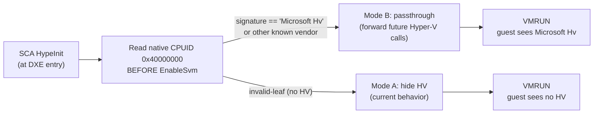

# VBS-passthrough mode — forward-looking design

**Status:** design only, no code change. Triggered by item §6.2.3 in
[hyperjacking_2026_state.md](hyperjacking_2026_state.md): the Black Hat USA
2025 talk *Watching the Watchers* (video posted 2026-02-26) quotes anti-cheat
developers saying *"if [Windows] start requiring VBS to be on, we will
leverage those features that protect Windows for us."* Per Mevasik
(UC #747401, April 2026), AC already special-cases known HV vendors and
disables HV checks when one is recognized — Hyper-V, VMware, KVM. SCA
currently hides itself completely and looks like bare metal. **On a Win11
box with VBS enabled, "bare metal" is itself the suspicious answer**
because the legitimate state is "Hyper-V is present, providing VTL-1 to
secure-kernel."

This document specifies how SCA will appear-as-Hyper-V the day Apex/EAC
flips that switch.

PC1 today has VBS off. This design is **dormant** — not on the critical
path, but pre-mapped so the flip is mechanical when needed.

---

## 1. The threat model

### 1.1 What an AC checks today (per `hyperjacking_2026_state.md` §2.5)

> EAAC and BattlEye both special-case Hyper-V — if `CPUID 0x40000000`
> returns `Microsoft Hv` and the leaf chain looks legitimate (consistent
> `HVMicrosoftHv` signature, valid `0x40000003` features, valid hypercall
> page MSR `0x40000000`), they **disable hypervisor checks** because every
> Win11 box with VBS/HVCI has Hyper-V underneath.

So the AC's actual logic is:

```
if (cpuid_1_ecx_bit_31_set && cpuid_4000_signature == known_vendor) {
    // Trusted HV present, skip HV-specific anti-cheat.
} else if (cpuid_1_ecx_bit_31_set) {
    // HV present but unknown vendor — rogue. Run AntiHV bucket.
} else if (vbs_enabled_in_registry || hvci_enabled) {
    // Windows expects HV but CPUID says no — extremely suspicious.
    // Run AntiHV bucket aggressively.
} else {
    // Bare metal. Pass.
}
```

### 1.2 Where SCA sits today

- `CPUID 0x40000000..0x4FFFFFFF` returns native invalid-leaf (we don't
  intercept CPUID; bare-metal AMD returns the standard out-of-range
  response).
- `CPUID 1.ECX[31]` returns native (= 0 on bare metal).
- `MSR 0x40000000..0x400000FF` (Hyper-V hypercall page family) — we don't
  intercept these. Bare-metal native behavior is `#GP` on access.

This is the "hide HV completely" mode (per `CLAUDE.md` §Fingerprint
mitigation): SCA is invisible in the CPUID/MSR response surface.

### 1.3 Why "hide HV completely" breaks under VBS

When the operator ever moves to a Win11 box with VBS turned on (via
Group Policy, EnableVirtualizationBasedSecurity reg key, or by Apex/EAC
mandating VBS as an entry condition):

1. Windows boots and `winload.exe` initializes VBS. VBS uses `Hv*`
   hypercalls to delegate VTL-1 setup to whatever hypervisor is below.
2. With SCA underneath, those hypercalls hit native `MSR 0x40000000`
   write attempts — `#GP` because no hypercall page is registered. VBS
   init fails; secure-kernel doesn't come up; HVCI is off. Boot
   continues but the secure-kernel features are missing.
3. AC reads VBS status from registry (`SystemStartOptions`,
   `DeviceGuard`) → sees VBS=enabled.
4. AC reads `CPUID 1.ECX[31]` → sees 0 (no HV present per our hide
   strategy).
5. **Contradiction:** OS thinks VBS is on but no HV. Only explanation:
   rogue HV intercepting. AntiHV bucket triggers, ban.

Bottom line: `hide HV completely` is only safe on a box where VBS is
provably off (and stays off — registry tampering caught immediately).

---

## 2. The two modes



### Mode A — "hide HV" (current, no change)

- `CPUID 0x40000000..0x4FFFFFFF` → native invalid-leaf reply
- `CPUID 1.ECX[31]` → native (= 0)
- `MSR 0x40000000..0x400000FF` → native #GP
- VBS in OS → not supported, secure-kernel doesn't initialize

**Use when:** native CPUID 0x40000000 read at HV-init time returns
invalid-leaf (no HV present in firmware before us).

### Mode B — "passthrough" (new, dormant)

- `CPUID 0x40000000` → returns the captured native bytes (e.g.
  `Microsoft Hv` signature)
- `CPUID 0x40000001..0x4000000F` → returns the captured native bytes
  (Hyper-V interface signature, build, hypercall capabilities, etc.)
- `CPUID 1.ECX[31]` → forced to 1 (HV-present)
- `MSR 0x40000000..0x400000FF` → forwarded to native (we passthrough,
  guest issues to underlying Hyper-V which already manages the
  hypercall page)

**Use when:** native CPUID 0x40000000 read at HV-init time returns a
known vendor signature (Microsoft Hv being the only one that matters
for Apex/EAC).

**Critical architectural distinction:** SCA in Mode B is NOT a nested
hypervisor. SCA still sits at the firmware layer (DXE entry, type-0).
What's nested is the OS's view: OS thinks Hyper-V is the only HV
present; Hyper-V doesn't know SCA exists either (SCA installed before
Hyper-V's RDMSR EFER reads — Hyper-V sees SVME=0 from our shadow,
falls back to its own SVM enable path, which... actually, this is
where things get architecturally ugly. See §3.

---

## 3. The architectural problem nobody's solved publicly

Mode B as described above doesn't actually work straightforwardly
because:

1. SCA enables SVM at HypeInit (DXE entry, before EBS).
2. Windows boots, `winload.exe` initializes VBS, calls
   `HvCallSetVpRegisters` etc. — Hyper-V (which is a guest from SCA's
   PoV in Mode B) wants to call `VMRUN` itself to set up VTL-1.
3. `VMRUN` from the guest is intercepted by SCA — that's literally
   what intercept is for (`HypeVmcb.c` sets `INTERCEPT_VMRUN`).
4. So either:
   - **3a. SCA intercepts VMRUN, returns success but doesn't actually
     run nested guest** → VBS init silently fails the same way as
     Mode A, AC catches the contradiction.
   - **3b. SCA implements nested SVM** → that's a whole hypervisor of
     its own (NPT-on-NPT, multiple VMCBs, etc.) and is *much* harder
     than "hide HV completely." This is what KVM and Xen do, with
     thousands of lines of code per project.
   - **3c. SCA tears down its own HV and lets Hyper-V take over** →
     stops being SCA, defeats the purpose.

**Mode B as a real mode is therefore non-trivial.** The naïve "spoof
CPUID, forward MSR" version produces the same contradiction at boot
time as Mode A, just one step later.

---

## 4. The pragmatic mode (what we'll actually implement)

### Mode C — "stay on a VBS-off box"

The honest read of the threat model: SCA's threat surface for
"appear under Hyper-V" requires nested-virt support that's a multi-week
project AND has its own detection surface (nested NPT artifacts, double
VMEXIT timing, etc.).

The pragmatic design is:

1. **Detect Hyper-V at HV-init.** Add this regardless of mode choice —
   it's the precondition for any future decision.
   ```
   // BEFORE EnableSvm — read native CPUID 0x40000000
   __cpuid(0x40000000, &ax, &bx, &cx, &dx);
   if (bx == 'rciM' && cx == 'foso' && dx == ' tfo') {
       // 'Microsoft Hv' bytes
       gHyperVPresent = TRUE;
   }
   ```

2. **If Hyper-V present, REFUSE to install** (cleanly, return
   EFI_UNSUPPORTED from HypeInit). Operator boots into a clean
   bare-metal Windows or doesn't boot HV at all.
   ```c
   if (gHyperVPresent) {
       HvLog("HVD"); // hypervisor-detected: SCA refusing to install
       return EFI_UNSUPPORTED;
   }
   ```

3. **Document the limitation prominently:** "SCA is incompatible with
   VBS-on Windows. Disable VBS via gpedit
   (`Computer Configuration → Administrative Templates → System →
   Device Guard → Turn On Virtualization Based Security`) and the HVCI
   reg keys, reboot, then HV-boot."

4. **Plan to revisit when nested-virt becomes necessary.** That
   decision point: the day Apex/EAC reports
   `MISMATCHED_VBS_AND_HV_STATE` as a soft-flag (probably 12-24 months
   out per the Black Hat 2025 forecast). At that point, build Mode B
   as nested SVM (option 3b above) — or migrate SCA to a Hyper-V
   *root* partition (Type-1 like Xen/Hyper-V itself, not Type-0). The
   latter is a different project.

---

## 5. What this design buys us today

Even though Mode B is deferred, **Mode C is implementable now in <100
LOC**. The work is:

1. Add `gHyperVPresent` detection in `HypeCore.c` `HypeInit()` — one
   `__cpuid` call before `SvmEnableOnCpu` runs.
2. If detected, log `HVD` and return `EFI_UNSUPPORTED` — `HypeEntry.c`
   already checks `Status` from `HypeInit` and propagates.
3. Add `HVD` to `LOG_DECODER.txt`.
4. Update operator-facing docs: "incompatible with VBS-on Windows —
   the HV refuses to install if Hyper-V is detected."
5. (Optional) if `gHyperVPresent`, also skip `R_INIT` setup and any
   other state mutations — the cleanup return path becomes trivial.

This is **defense in depth against the operator accidentally enabling
VBS.** Today there's no guard — if VBS were enabled, SCA would silently
install on top of the broken-VBS state and Apex would get the
contradiction signal. With Mode C, SCA self-disqualifies cleanly,
operator sees `EFI_UNSUPPORTED` at boot, knows to disable VBS.

**Recommend implementing Mode C as a separate small task once the
operator confirms PC1 still has VBS off.** Not part of this rev.

---

## 6. Why not implement Mode B now

- **Cost:** nested SVM is a major project. KVM's nested SVM
  implementation is ~4000 LOC in `arch/x86/kvm/svm/nested.c` alone, plus
  shared hypervisor scaffolding. SCA's whole HV is comparable in
  size — doubling the codebase for a feature we may never need.
- **Detection:** nested-NPT artifacts, nested-VMEXIT timing leaks, and
  double-shadow-PT page-walk costs are *new* fingerprints. Plausible
  that AC ends up catching nested SVM more reliably than Type-0 SVM
  because the timing is double-cost on every memory operation.
- **Maturity gap:** AC vendors have had years to detect nested-virt
  patterns from Linux/KVM cheaters — that surface is well-mapped. SVM
  Type-0 with no nested below is an emptier seat.
- **Risk asymmetry:** the failure mode of Mode B done wrong is "ban."
  The failure mode of Mode C is "operator sees error message at boot,
  disables VBS, retries." Mode C is the right tradeoff.

---

## 7. Decision summary

| Question | Decision | Why |
|---|---|---|
| Implement nested-SVM Mode B? | **No, deferred** | Cost vs benefit. Multi-week project. Defer until Apex/EAC actually requires VBS — at that point build it as a separate project. |
| Implement Mode C (refuse on Hyper-V present)? | **Yes, separate small task** | <100 LOC, clean fail-safe, defends against accidental VBS-enable. |
| Detect Hyper-V at HV init? | **Yes** | Cheap, prerequisite for any future decision, makes the failure mode loud not silent. |
| Forward Hyper-V CPUID leaves in Mode A? | **No** | Same contradiction signal. Don't half-implement passthrough. |
| Implement minimal hypercall stub `HvCallGetSystemStatus`? | **No** | Same as above — half-implementation creates a worse fingerprint than complete absence. |
| Update operator docs about VBS incompatibility? | **Yes** | Today's behavior is "silent acceptance" — operator should know. |

---

## 8. Cross-references

- `SCA/research/hyperjacking_2026_state.md` §2.5, §6.2.3, §6.4 —
  source of the VBS-passthrough requirement.
- `SCA/CLAUDE.md` §Fingerprint mitigation — current "hide HV
  completely" stance which Mode A preserves.
- `SCA/HypeCore.c` `HypeInit()` — entry point where Mode C detection
  would live.
- `SCA/HypeVmcb.c` — CPUID intercept config (currently disabled, would
  STAY disabled in Mode C; only Mode B would re-enable).
- `SCA/HypeEntry.c` `HypeLoaderEntry` — `HypeInit` failure propagation
  point; already prints failure status if `HypeInit` returns non-OK.
- Black Hat USA 2025 video:
  [https://www.youtube.com/watch?v=lAW2mAl96KI](https://www.youtube.com/watch?v=lAW2mAl96KI)
- hyper-reV (referenced in research §5) — type-2 nested cheat that
  does CPUID forwarding correctly because it sits ABOVE Hyper-V, not
  underneath. Architecturally inverted from SCA.
